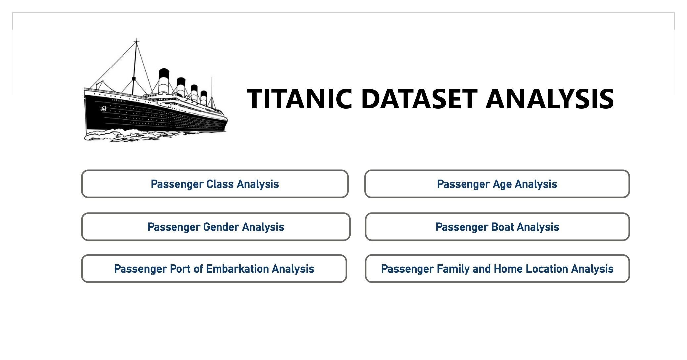
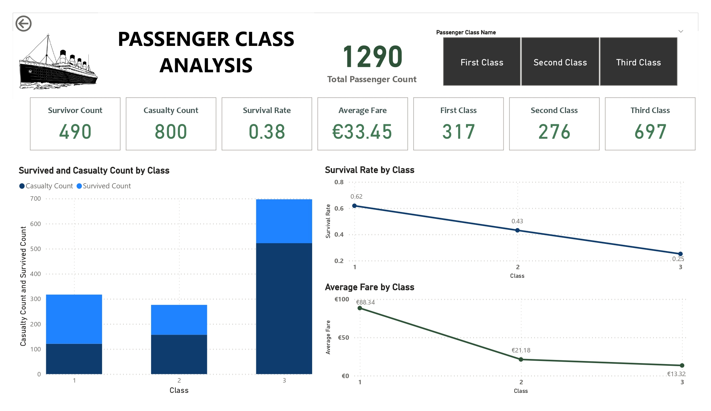
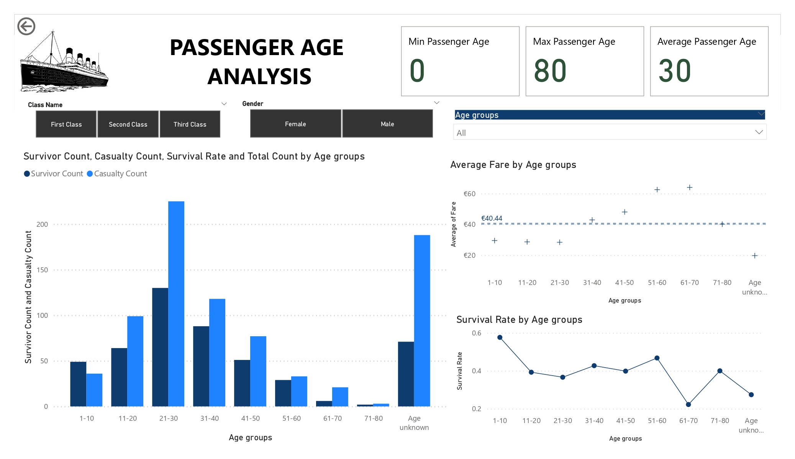
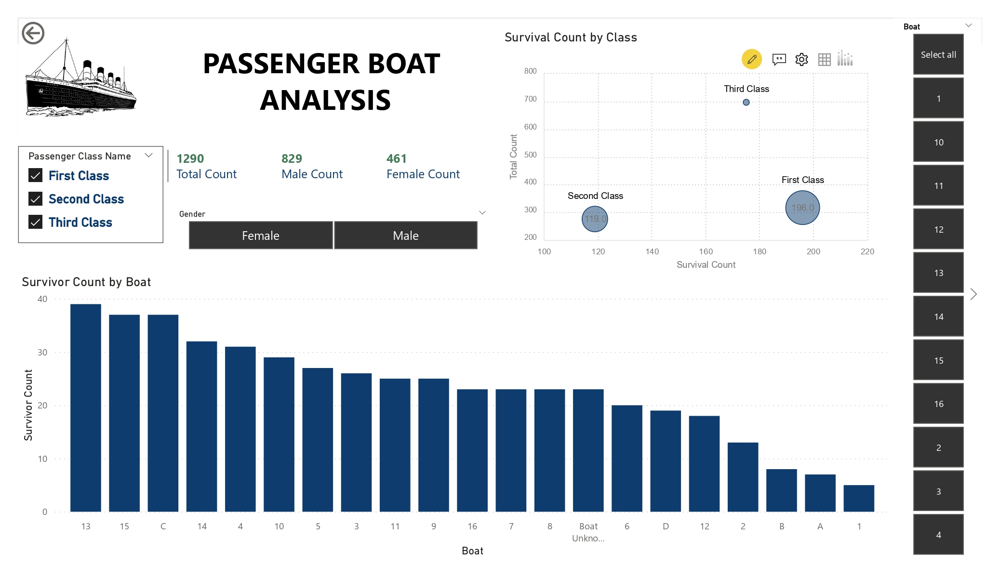
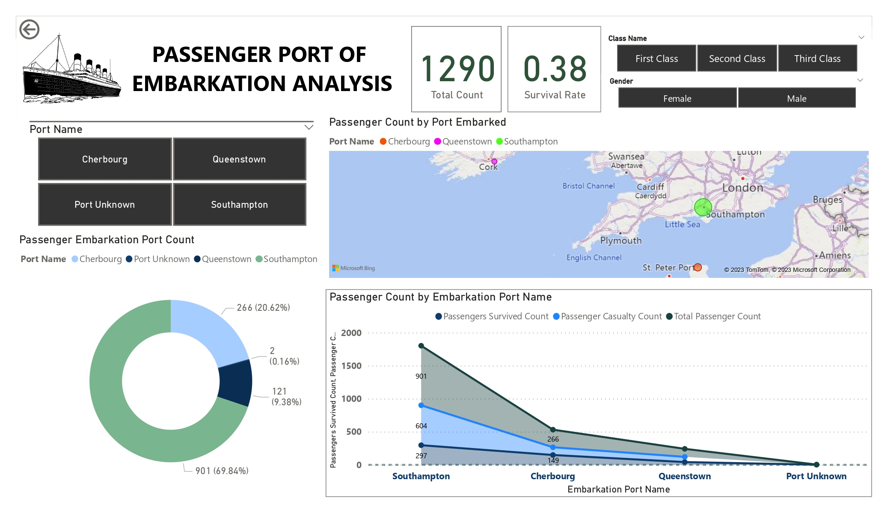
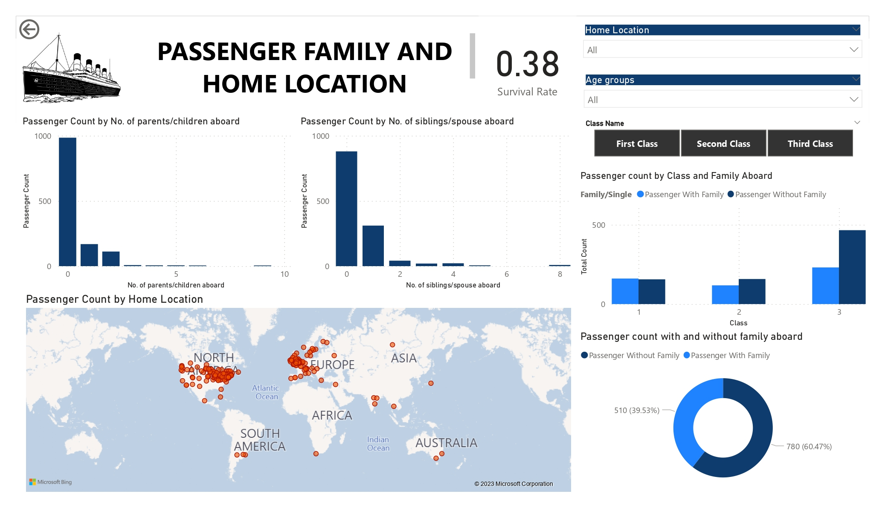

# Titanic_Dataset_Analysis
Conducted Titanic Dataset Analysis using Power BI

 In this exploratory data analysis, I utilized Power BI to explore the Titanic dataset from Kaggle (https://www.kaggle.com/datasets/vinicius150987/titanic3?resource=download), providing information about the passengers aboard the RMS Titanic during its tragic maiden voyage in 1912. By leveraging exploratory data analysis techniques and visualizations, I delved into the dataset's features such as age, gender, passenger class, fare, cabin, port of embarkation, and survival status. Through independent analysis using Power BI, I identified significant distributions, correlations, and patterns, allowing me to gain comprehensive insights into the factors influencing the survival of the Titanic passengers.

Data model: I adopted the star schema structure to load the data and build the data model. The fact table was designed to include measurable attributes such as boat, body, class, survived, and fare, serving as the central table for analysis. Additionally, I created four-dimension tables. The port dimension table provided information on the ports of embarkation. The passenger dimension table captured detailed information about each passenger, including name, ticket, age, cabin occupied, home destination, and gender. The class dimension table focused on the passenger class attribute. The lifeboat dimension table represented the assigned lifeboat for passengers.

1. The Home Page in Power BI acts as an index, providing an overview of available analysis classifications. It enables users to navigate to specific classifications through interactive buttons. Serving as a central hub, it streamlines exploration and enhances the user experience by facilitating easy access to desired analysis subsets within the report.

2. The "Passenger Class Analysis" page in the Power BI report examines the relationship between passenger class and factors such as casualty and survival counts, survival rate, and average fare. A stacked column chart illustrates casualty and survival counts, while line charts show declining survival rates and fares with a higher class. These visuals provide insights into socio-economic dynamics and class-based disparities among Titanic passengers.

   

3. The "Passenger Age Analysis" page in the Power BI report examines the relationship between passenger age and various factors. It includes a stacked column chart showing casualty and survival counts by age group. A scatter chart displays average fare by age group, and a line graph shows survival rates. Notably, the age group 21-30 exhibits the highest casualty and survival count.

4. The "Passenger Gender Analysis" page in Power BI examines the relationship between passenger gender and aspects such as survival rate, average fare, and counts of recovered and unrecovered bodies. Visualizations include a stacked column chart comparing survival rates, a funnel chart comparing average fares, and a sunburst chart displaying body recovery counts. Females had higher survival rates and paid higher fares on average compared to males.

5. The "Passenger Boat Analysis" page in the Power BI report focuses on the relationship between rescue boats and passenger survival. It includes a column chart showing the count of survivors per boat and a scatter/bubble chart displaying survival rates by boat and passenger class. The analysis highlights boat 13 as having the highest number of survivors, with 39 passengers successfully rescued.

   

6. The "Passenger Port of Embarkation Analysis" page focuses on the relationship between the port of embarkation and passenger statistics. A donut chart displays passenger counts for each port. A stacked area chart shows survivor, casualty, and total passenger counts per port. A map visualizes the geographical locations of the, highlighting Southampton as a significant embarkation point.

7. The "Passenger Family and Home Location Analysis" page in Power BI examines the relationships between passenger family characteristics and home locations. It includes column charts for the count of parents/children and siblings/spouse. A stacked column chart shows the count of passengers with/without family by class, and a map displays passenger count by home location, revealing geographic patterns.

